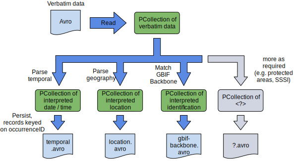
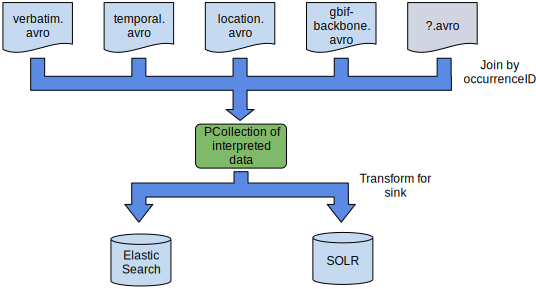

[](https://builds.gbif.org/job/pipelines/)
[](https://sonar.gbif.org/dashboard?id=org.gbif.pipelines%3Apipelines-parent)

# Table of Contents

- [**About the project**](#about-the-project)
- [**Architecture**](#architecture)
    - [**Ingress**](#ingress)
    - [**Interpretation**](#interpretation)
    - [**Indexing**](#indexing)
- [**Structure**](#structure)
- [**How to build the project**](#how-to-build-the-project)
- [**Codestyle and tools recommendations**](#codestyle-and-tools-recommendations)

# About the project

**REMEMBER, YOU HAVE TO USE JAVA VERSION 8**

**Pipelines for data processing and indexing of biodiversity data**

_Status: IN PRODUCTION_

Vision: Consistent data processing pipelines (parsing, interpretation and quality flagging) for use in GBIF, the Living Atlases project and beyond.
Built to scale from laptop to GBIF volumes. Deployable on JVM, Spark, Google Cloud, <insert your favourite cloud provider here>.

# Architecture

The project provides vanilla JVM-based parsing and interpretation libraries, and pipelines for indexing into SOLR and ElasticSearch, built using Apache Beam.

> Apache Beam provides a high level abstraction framework ideal for this purpose with the ability to deploy across target environments (e.g. Spark, local JVM) and with many built in connectors for e.g. HBase, SOLR, ElasticSearch etc.

## Ingress

Ingress is from [Darwin Core Archive](https://www.tdwg.org/standards/dwc/) (zip files of one or more delimited text files) or ABCD Archives (compressed XML) only[1].
During ingress data is converted from its native format and stored as [Avro](https://avro.apache.org/docs/current/) files containing Darwin Core compliant data.

This is depicted below:


> Avro is chosen as a storage and interchange format exclusively in this project because a) it is splittable with each split compressed independently, b) it holds the data schema with the data, c) is well supported in the Hadoop ecosystem (e.g. Hive, Spark) and many other tools (e.g. Google Cloud) d) is very robust in serialization and e) reduces boiler plate code thanks to schema to code generators. Darwin Core Archives and JSON for example do not exhibit all these traits.

[1] Other protocols (e.g. DiGIR, TAPIR) are supported by GBIF but are converted by crawling code upstream of this project.

## Interpretation

During interpretation the verbatim data is parsed, normalised and tested against quality control procedures.

To enable extensibility data is interpreted into separate [`avro`](https://avro.apache.org/docs/current/) files where a separate file per category of information is used.  Many interpretations such as `date / time` formatting are common to all deployments, but not all.
For example, in the [GBIF.org](https://www.gbif.org) deployment the scientific identification is normalised to the GBIF backbone taxonomy and stored in `/interpreted/taxonomy/interpreted*.avro` which might not be applicable to everyone.
Separating categories allows for extensibility for custom deployments in a reasonably modular fashion.

Interpretation is depicted below:



> Note that all pipelines are designed and tested to run with the `DirectRunner` and the `SparkRunner` at a minimum.  This allows the decision to be taken at runtime to e.g. opt to interpret a small dataset in the local JVM without needing to use cluster resources for small tasks.

> It is a design decision to ensure that all the underlying parsers are as reusable as possible for other projects with careful consideration to not bring in dependencies such as Beam or Hadoop.

## Indexing

Initial implementations will be available for both SOLR and for ElasticSearch to allow for evaluation of both at GBIF.
During indexing the categories of interpreted information of use are merged and loaded into the search indexes:



> Note that GBIF target 10,000 records/sec per node indexing speed (i.e. 100,000 records/sec on current production cluster).  This will allow simplified disaster recovery and rapid deployment and of new features.

# Structure

The project is structured as:

_DEPRECATED STRUCTURE_:
- [**.buildSrc**](./.buildSrc) - Tools for building the project
- [**docs**](./docs) - Documents related to the project
- [**examples**](./examples) - Examples of using project API and base classes
    - [**transform**](./examples/transform) - Transform example demonstrates how to create Apache Beam pipeline, create the new transformation and use it together with GBIF transforms and core classes
    - [**metrics**](./examples/metrics) - The example demonstrates how to create and send Apache Beam SparkRunner metrics to ELK and use the result for Kibana dashboards
- [**pipelines**](./pipelines) - Main pipelines module
    - [**beam-common**](./pipelines/beam-common) - Classes and API for using with Apache Beam
    - [**common**](./pipelines/common) - Only static string variables
    - [**export-gbif-hbase**](./pipelines/export-gbif-hbase) - The pipeline to export the verbatim data from the GBIF HBase tables and save as `ExtendedRecord` avro files
    - [**ingest-gbif**](./pipelines/ingest-gbif) - Main GBIF pipelines for ingestion of biodiversity data
    - [**ingest-gbif-standalone**](./pipelines/ingest-gbif-standalone) - Independent GBIF pipelines for ingestion of biodiversity data
    - [**ingest-hdfs-table**](./pipelines/ingest-hdfs-table) - Pipeline classes for conversion from interpreted formats into one common for HDFS view creation
    - [**ingest-transforms**](./pipelines/ingest-transforms) - Transformations for ingestion of biodiversity data
- [**sdks**](./sdks) - Main module contains common classes, such as data models, data format interpretations, parsers, web services clients etc.
    - [**core**](./sdks/core) - Main API classes, such as data interpretations, converters, [DwCA](https://www.tdwg.org/standards/dwc/) reader etc.
    - [**models**](./sdks/models) - Data models represented in Avro binary format, generated from [Avro](https://avro.apache.org/docs/current/) schemas
    - [**parsers**](./sdks/parsers) - Data parsers and converters, mainly for internal usage inside of interpretations
    - [**keygen**](./sdks/keygen) - The library to generate GBIF identifiers, to support backward compatibility the codebase (with minimum changes) was copied from the occurrence/occurrence-persistence project
- [**tools**](./tools) - Module for different independent tools
    - [**archives-converters**](./tools/archives-converters) - Converters from [DwCA/DWC 1.0/DWC 1.4](https://www.tdwg.org/standards/dwc/)/ABCD 1.2/ABCD 2.06 to *.[avro](https://avro.apache.org/docs/current/) format
    - [**elasticsearch-tools**](./tools/elasticsearch-tools) - Tool for creating/deleting/swapping Elasticsearch indexes
    - [**pipelines-maven-plugin**](./tools/pipelines-maven-plugin) - Maven plugin adds new annotations and interface to [avro](https://avro.apache.org/docs/current/) generated classes

# How to build the project

The project uses [Apache Maven](https://maven.apache.org/) for building. The project contains a Maven wrapper script for Linux and MacOS systems, you just can run the **`build.sh`** script:

```shell
./build.sh
```

Please read the [Apache Maven how-to](https://maven.apache.org/run.html).

# Contributions

We welcome contributions! Please see [the guide](./CONTRIBUTING.md) to see how you can best do this.
