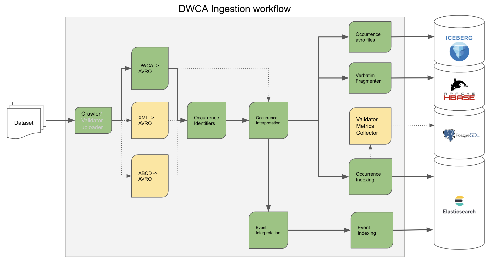

[](https://builds.gbif.org/view/Stackable/job/pipelines-multibranch/job/dev/)
[](https://builds.gbif.org/job/pipelines-master/)
[](https://builds.gbif.org/job/pipelines-dev2-smoke-testing/)

# Table of Contents

- [**About the project**](#about-the-project)
- [**Architecture**](#architecture)
    - [**Ingress**](#ingress)
    - [**Interpretation**](#interpretation)
    - [**Indexing**](#indexing)
- [**Structure**](#structure)
- [**How to build the project**](#how-to-build-the-project)
- [**Contributions**](#contributions)

# About the project

*SUPPORTED JAVA 11+ VERSION*

**Pipelines for data processing and indexing of biodiversity data**

_Status: IN PRODUCTION_

Vision: Consistent data processing pipelines (parsing, interpretation and quality flagging) for use in GBIF, the Living Atlases project and beyond.
Built to scale from laptop to GBIF volumes. Avalaible 2 version sharing the same core: Java for small size data (fits local memory) and Apache Beam for Spark engine (Google Cloud, Databricks, Kubernetes, etc.).

# Architecture

The project provides vanilla JVM-based parsing and interpretation libraries, and tasks for data interpreataion and indexing into Elasticsearch.

> Apache Beam provides a high level abstraction framework ideal for this purpose with the ability to deploy across target environments (e.g. Spark, local JVM) and with many built in connectors for e.g. HBase, SOLR, Elasticsearch etc.

## Ingress

Ingress is from [Darwin Core Archive](https://www.tdwg.org/standards/dwc/) (zip files of one or more delimited text files) or ABCD Archives (compressed XML) only[1].
During ingress data is converted from its native format and stored as [Avro](https://avro.apache.org/docs/current/) files containing Darwin Core compliant data.

This is depicted below:


> Avro is chosen as a storage and interchange format exclusively in this project because a) it is splittable with each split compressed independently, b) it holds the data schema with the data, c) is well supported in the Hadoop ecosystem (e.g. Hive, Spark) and many other tools (e.g. Google Cloud) d) is very robust in serialization and e) reduces boiler plate code thanks to schema to code generators. Darwin Core Archives and JSON for example do not exhibit all these traits.

[1] Other protocols (e.g. DiGIR, TAPIR) are supported by GBIF but are converted by crawling code upstream of this project.

## Interpretation

During interpretation the verbatim data is parsed, normalised and tested against quality control procedures.

To enable extensibility data is interpreted into separate [`avro`](https://avro.apache.org/docs/current/) files where a separate file per category of information is used.  Many interpretations such as `date / time` formatting are common to all deployments, but not all.
For example, in the [GBIF.org](https://www.gbif.org) deployment the scientific identification is normalised to the GBIF backbone taxonomy and stored in `/occurrence/taxonomy/interpreted*.avro` which might not be applicable to everyone.
Separating categories allows for extensibility for custom deployments in a reasonably modular fashion.

Interpretation is depicted below:


> Note that all pipelines are designed and tested to run with the `DirectRunner` and the `SparkRunner` at a minimum.  This allows the decision to be taken at runtime to e.g. opt to interpret a small dataset in the local JVM without needing to use cluster resources for small tasks.

> It is a design decision to ensure that all the underlying parsers are as reusable as possible for other projects with careful consideration to not bring in dependencies such as Beam or Hadoop.

## Indexing

Current implementation available for Elasticsearch to allow for evaluation of both at GBIF.
During indexing the categories of interpreted information of use are merged and loaded into the search indexes:


> Note that GBIF target 10,000 records/sec per node indexing speed (i.e. 100,000 records/sec on current production cluster).  This will allow simplified disaster recovery and rapid deployment and of new features.

## Simplified workflow


# Structure

The project is structured as:

- [**build**](./build) - Shell scripts to build Docker images
- [**docs**](./docs) - Documents related to the project
- [**examples**](./examples) - Examples of using project API and base classes
    - [**dwca-to-elasticsearch**](./examples/dwca-to-elasticsearch) - An example of using the Pipelines project: it interprets a sample DWCA into an Elasticsearch index.
    - [**transform**](./examples/transform) - Transform example demonstrates how to create Apache Beam pipeline, create the new transformation and use it together with GBIF transforms and core classes
    - [**metrics**](./examples/metrics) - The example demonstrates how to create and send Apache Beam SparkRunner metrics to ELK and use the result for Kibana dashboards
- [**gbif**](./gbif) - GBIF main module
    - [**coordinator**](./gbif/coordinator) - The main controller orchestrates pipeline task workflows, running Airflow Spark jobs and Java-based workflows
    - [**identifiers**](./gbif/identifiers) - Module responsible for work with GBIF identifiers
      - [**diagnostics**](./gbif/identifiers/diagnostics) - Internal tool to fix GBIF identifiers collisions
      - [**keygen**](./gbif/identifiers/keygen) - The library to generate GBIF identifiers, to support backward compatibility the codebase (with minimum changes) was copied from the occurrence/occurrence-persistence project
    - [**ingestion**](./gbif/ingestion) - Main pipelines workflow module
      - [**ingest-gbif-beam**](./gbif/ingestion/ingest-gbif-beam) - Main GBIF pipelines for ingestion of biodiversity data
      - [**ingest-gbif-fragmenter**](./gbif/ingestion/ingest-gbif-fragmenter) - Writes raw archive's data to HBase store
      - [**ingest-gbif-java**](./gbif/ingestion/ingest-gbif-java) - Implementation of **ingest-gbif-beam** Implementation of the ingest-gbif-beam module in Java-only ensures fast processing of small datasets utulizing only local JVM instance
    - [**validator**](./gbif/validator) - Backend part for [GBIF Data validator](https://www.gbif.org/tools/data-validator)
- [**livingatlas**](./livingatlas) - Living atlas main module
- [**sdks**](./sdks) - Main module contains common classes, such as data models, data format interpretations, parsers, web services clients etc.
    - [**beam-common**](./sdks/beam-common) - Classes and API for using with Apache Beam
    - [**beam-transforms**](./sdks/beam-transforms) - Transformations for ingestion of biodiversity data
    - [**core**](./sdks/core) - Main API classes, such as data interpretations, converters, [DwCA](https://www.tdwg.org/standards/dwc/) reader etc.
    - [**models**](./sdks/models) - Data models represented in Avro binary format, generated from [Avro](https://avro.apache.org/docs/current/) schemas
    - [**plugins**](./sdks/plugins) - Maven plugins
      - [**maven-avro-annotation-editor**](./sdks/plugins/maven-avro-annotation-editor) - Maven plugin adds new annotations and interface to [avro](https://avro.apache.org/docs/current/) generated classes
      - [**maven-extension-java-code-generator**](./sdks/plugins/maven-extension-java-code-generator) - Java code generator plugin for DWC extensions
      - [**maven-occurrence-avsc-schema-generator**](./sdks/plugins/maven-occurrence-avsc-schema-generator) - AVRO schema generator plugin to generate occurrence schema
    - [**tools**](./sdks/tools) - SDKs tools
      - [**archives-converters**](./sdks/tools/archives-converters) - Converters from [DwCA/DWC 1.0/DWC 1.4](https://www.tdwg.org/standards/dwc/)/ABCD 1.2/ABCD 2.06 to *.[avro](https://avro.apache.org/docs/current/) format
      - [**elasticsearch-tools**](./sdks/tools/elasticsearch-tools) - Tool for creating/deleting/swapping Elasticsearch indexes
    - [**variables**](./sdks/variables) - Simple static string variables

# How to build the project

The project uses [Apache Maven](https://maven.apache.org/) as a build tool. Additionally, it utilizes a [Jenkins pipeline](Jenkinsfile) as part of its CI/CD continuous deployment process.

#### Available Maven profiles:
- skip-coverage (skips Jacoco coverage file generation)
- coverage (generates correct Jacoco coverage files)
- skip-release-it (skips heavy IT tests for rarely changed code)
- gbif-artifacts (creates main shaded GBIF artifacts)
- livingatlas-artifacts (creates main shaded Livingatlas artifacts)
- extra-artifacts (creates shaded artifact for non-ingestion tools and projects)

#### For local build use following:

Building the project without tests and shaded artifacts, suitable for everyday local development (~3 mins on a laptop)
```shell
mvn spotless:apply clean package -P skip-coverage -T 1C -DskipTests -nsu
```

Building the project with unit tests and main IT tests, assemble main GBIF artifacts, suitable for CI development builds (~15 mins on a laptop)
```shell
mvn clean install verify -U -T 3 -P skip-coverage,skip-release-it,gbif-artifacts
```

Building the project with all tests, coverage, assemble all artifacts, suitable for project releases 
```shell
mvn clean install verify -U -P coverage,gbif-artifacts,livingatlas-artifacts,extra-artifacts
```

Please read the [Apache Maven how-to](https://maven.apache.org/run.html).

# Contributions

We welcome contributions! Please see [the guide](./CONTRIBUTING.md) to see how you can best do this.
