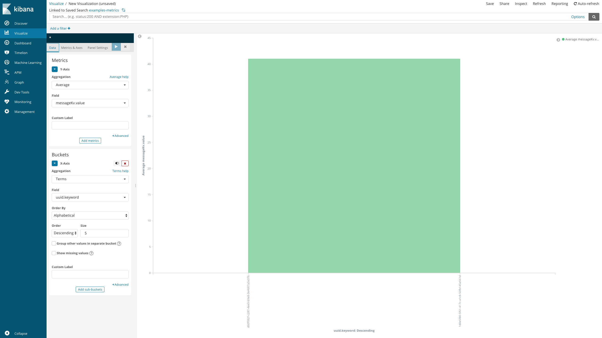

# The example demonstrates how to create and send Apache Beam SparkRunner metrics to ELK and use the result for Kibana dashboards

## Main objective
The main goal is getting metrics (number of records, failures and etc.) during the ingestion process, collect and analyze them after. Because our main distributed system is [Apache Spark](http://spark.apache.org/) and we use [ELK](https://www.elastic.co/elk-stack) for logging, and Spark supports [several sinks](https://spark.apache.org/docs/latest/monitoring.html#metrics), we will try to use Spark Slf4J sink and log all Apache Beam metrics to [ELK](https://www.elastic.co/elk-stack) stack, and create a visual dashboard in Kibana.

## The example
This example demonstrates how to set up a processing pipeline that can read a text file, filter only `foo` words and count number of `foo` and `non-foo` words as metrics, log them to ELK and create a visual chart.

### Base sequence of actions to get the result:
 - 1 [Java project level:](#1-java-project-level)
    - 1.1 [Add all necessary dependencies to the project](#11-add-all-necessary-dependencies-to-the-project)
    - 1.2 [Create Apache Beam pipeline class](#12-create-apache-beam-pipeline-class)
    - 1.3 [Add ParDo function with Apache Beam Counter to the class](#13-add-pardo-function-with-apache-beam-counter-to-the-class)
    - 1.4 [Add additional information to the logger](#14-add-additional-information-to-the-logger)
    - 1.5 [Create Apache Beam adapter for Spark Slf4j sink](#15-create-apache-beam-adapter-for-spark-slf4j-sink)
 - 2 [Spark level:](#2-spark-level)
    - 2.1 [Create metrics properties](#21-create-metrics-properties)
    - 2.2 [Create log4j properties](#22-create-log4j-properties)
 - 3 [Logstash level:](#3-logstash-level)
    - 3.1 [Create Logstash configuration](#31-create-logstash-configuration)
 - 4 [How to run:](#4-how-to-run)
    - 4.1 [Run ELK](#41-run-elk)
    - 4.2 [Run Spark standalone](#42-run-spark-standalone)
    - 4.3 [Run Spark cluster](#43-run-spark-cluster)
 - 5 [Elasticsearch level:](#5-elasticsearch-level)
    - 5.1 [Change index template](#51-change-index-template)
 - 6 [Kibana level:](#6-kibana-level)
    - 6.1 [Update index patterns](#61-update-index-patterns)
    - 6.2 [Create visualization and dashboard](#62-create-visualization-and-dashboard)

---

### 1. Java project level

- Dependencies:
    - [pom.xml](./pom.xml)
- Java classes:
    - [MetricsPipeline.java](./src/main/java/org/gbif/pipelines/examples/MetricsPipeline.java)
- Resources:
    - [log4j.properties](./src/main/resources/log4j.properties)
    - [metrics.properties](./src/main/resources/metrics.properties)


#### 1.1 Add all necessary dependencies to the project
In our case we run Spark as a standalone instance, please check [pom.xml](./pom.xml) to find out dependencies and plugins (if you use Spark cluster, you must delete Spark section in pom.xml and change hadoop dependencies scopes from **compile** to **provided** and also you must [add GELF library to Spark classpath](#43-run-spark-cluster)).

You can find more about [Beam Spark runner](https://beam.apache.org/documentation/runners/spark/).

#### 1.2 Create Apache Beam pipeline class

Create simple [Apache Beam pipeline class](./src/main/java/org/gbif/pipelines/examples/MetricsPipeline.java#L33), where we:
1. Create pipeline from custom options

```java
InterpretationPipelineOptions options =
    PipelinesOptionsFactory.create(InterpretationPipelineOptions.class, args);
Pipeline p = Pipeline.create(options);
}
```
2. Read the source file and apply custom ParDo function for filtering `foo` words

```java
p.apply("Reads file", TextIO.read().from(options.getInputPath()))
    .apply("Filters words", ParDo.of(new FilterTextFn()));
}
```
3. Run the pipeline

```java
LOG.info("Running the pipeline");
p.run().waitUntilFinish();
LOG.info("Pipeline has been finished");
}
```

#### 1.3 Add ParDo function with Apache Beam Counter to the class

Add custom [DoFn with Counters](./src/main/java/org/gbif/pipelines/examples/MetricsPipeline.java#L58) (Read more about [Apache Beam Metrics](https://beam.apache.org/documentation/sdks/javadoc/2.0.0/org/apache/beam/sdk/metrics/Metrics.html)), where we:

```java
  private static class FilterTextFn extends DoFn<String, String> {

    private final Counter fooCounter = Metrics.counter(MetricsPipeline.class, "foo");
    private final Counter nonfooCounter = Metrics.counter(MetricsPipeline.class, "nonfoo");

    @ProcessElement
    public void processElement(ProcessContext c) {
      String element = c.element();
      if (element.equals("foo")) {
        fooCounter.inc();
        c.output(element);
      } else {
        nonfooCounter.inc();
      }
    }
  }
```

#### 1.4 Add additional information to the logger

[Call MDC.put after main method](./src/main/java/org/gbif/pipelines/examples/MetricsPipeline.java#L40) to add id for each logger message:

```java
MDC.put("uuid", UUID.randomUUID().toString());
```

#### 1.5 Create Apache Beam adapter for Spark Slf4j sink

Basically [Slf4jSink.java](../../pipelines/beam-common/src/main/java/org/gbif/pipelines/common/beam/Slf4jSink.java) is adapter for Spark Slf4J sink, which is absent in Apache Beam Spark runner (used v2.7.0).

```java
package org.gbif.pipelines.common.beam;

import java.util.Properties;

import com.codahale.metrics.MetricRegistry;
import org.apache.beam.runners.spark.metrics.AggregatorMetric;
import org.apache.beam.runners.spark.metrics.WithMetricsSupport;

/**
 * A Spark {@link org.apache.spark.metrics.sink.Sink} that is tailored to report {@link
 * AggregatorMetric} metrics to Slf4j.
 */
public class Slf4jSink extends org.apache.spark.metrics.sink.Slf4jSink {
  public Slf4jSink(
      final Properties properties,
      final MetricRegistry metricRegistry,
      final org.apache.spark.SecurityManager securityMgr) {
    super(properties, WithMetricsSupport.forRegistry(metricRegistry), securityMgr);
  }
}
```

---

### 2 Spark level

To turn on metrics support in Spark we must provide metrics.properties and for sending logs to ELK we must change Spark logger properties.

#### 2.1 Create metrics properties

Create metrics.properties file, necessary for Spark monitoring, please read about [Spark metrics](https://spark.apache.org/docs/latest/monitoring.html#metrics)

```properties
executor.sink.slf4j.class=org.apache.spark.metrics.sink.Slf4jSink
driver.sink.slf4j.class=org.gbif.pipelines.common.beam.Slf4jSink
```
Find the final configuration - [metrics.properties](./src/main/resources/metrics.properties)

#### 2.2 Create log4j properties

Add ELK appender part to Spark log4j properties, please read about all [Logstash/Gelf Loggers](http://logging.paluch.biz/examples/log4j-1.2.x.html) settings.

```properties
# ELK appender
log4j.appender.gelf=biz.paluch.logging.gelf.log4j.GelfLogAppender
log4j.appender.gelf.Threshold=INFO
log4j.appender.gelf.Host=udp:127.0.0.1
log4j.appender.gelf.Port=12201
log4j.appender.gelf.Version=1.1
log4j.appender.gelf.Facility=examples-metrics
log4j.appender.gelf.ExtractStackTrace=true
log4j.appender.gelf.FilterStackTrace=true
log4j.appender.gelf.MdcProfiling=true
log4j.appender.gelf.TimestampPattern=yyyy-MM-dd HH:mm:ss,SSSS
log4j.appender.gelf.MaximumMessageSize=8192
log4j.appender.gelf.MdcFields=uuid
log4j.appender.gelf.IncludeFullMdc=true
```
Find the final configuration - [log4j.properties](./src/main/resources/log4j.properties)

---

### 3 Logstash level

We must add/change Logstash configuration to add new listener for gelf input, add filter for message value and output result to Elasticsearch

#### 3.1 Create Logstash configuration

Create a simple Logstash configuration file and call it `examples-metrics.config`. For more detailed information please read articles [Logstash configuration file structure](https://www.elastic.co/guide/en/logstash/current/configuration-file-structure.html) and [more complex examples](https://www.elastic.co/guide/en/logstash/current/config-examples.html)

#### Input section
Add input section to listen the host and port for [GELF(The Graylog Extended Log Format)](http://docs.graylog.org/en/2.4/pages/gelf.html) messages
```
input {
    gelf {
        host => "127.0.0.1"
        port => "12201"
    }
}
```

#### Filter section
In our case necessary information about metrics is stored in `message` field.
We can add filter section with [kv](https://www.elastic.co/guide/en/logstash/current/plugins-filters-kv.html#plugins-filters-kv), kv helps automatically parse messages and convert from string to json.

Before kv filter:
```
"message": "type=GAUGE, name=local-1538473503470.driver.MetricsPipeline.Beam.Metrics.Counts_quantity_using_metrics_ParMultiDo_FilterText.org.gbif.pipelines.examples.MetricsPipeline.foo, value=41.0"
```

After kv filter:
```json
"message": {
    "type": "GAUGE",
    "name": "local-1538473503470.driver.MetricsPipeline.Beam.Metrics.Counts_quantity_using_metrics_ParMultiDo_FilterText.org.gbif.pipelines.examples.MetricsPipeline.foo",
    "value": "41.0"
}
```

- `source` - a field for parsing
- `target` - a new field for parsed result
- `field_split` - split characters, in our case it is a comma
- `trim_key` - to remove spaces in a key
```
filter {
    kv {
        source => "message"
        target => "messageKv"
        field_split => ","
        trim_key => " "
    }
}
```

#### Output section
For output logs to console and Elasticsearch add output section:
```
output {
    stdout {
        codec => "rubydebug"
    }
    elasticsearch {
        hosts => "localhost:9200"
        index => "examples-metrics"
    }
}
```

Find the final configuration - [metrics.properties](./src/main/resources/examples-metrics.config)

### 4. How to run

#### 4.1 Run ELK

If you don't have an [ELK](https://www.elastic.co/elk-stack) instance, you can:

[Download and run Elasticsearch](https://www.elastic.co/downloads/elasticsearch)
```shell
elasticsearch/bin/elasticsearch
```

[Download and run Kibana](https://www.elastic.co/downloads/kibana)
```shell
kibana/bin/kibana
```

[Download and run Logstash](https://www.elastic.co/downloads/logstash) using `examples-metrics.config` configuration created in step [3](#3-logstash-main-configuration)
```shell
logstash/bin/logstash -f examples-metrics.config
```

#### 4.2 Run Spark standalone

Standalone Spark, [build the project](https://github.com/gbif/pipelines#how-to-build-the-project) and run:
```shell
java -jar target/examples-metrics-BUILD_VERSION-shaded.jar src/main/resources/example.properties
```

#### 4.3 Run Spark cluster

- Remove Spark section in the project [pom.xml](./pom.xml)
- Download [logstash-gelf-1.11.2.jar](http://central.maven.org/maven2/biz/paluch/logging/logstash-gelf/1.12.0/logstash-gelf-1.12.0.jar) library
- [Build the project](https://github.com/gbif/pipelines#how-to-build-the-project)
- Copy examples-metrics-BUILD_VERSION-shaded.jar, your configs and properties to your Spark gateway and run
```shell
spark2-submit --conf spark.metrics.conf=metrics.properties --conf "spark.driver.extraClassPath=logstash-gelf-1.11.2.jar" --driver-java-options "-Dlog4j.configuration=file:log4j.properties" --class org.gbif.pipelines.examples.MetricsPipeline --master yarn examples-metrics-BUILD_VERSION-shaded.jar --runner=SparkRunner --inputPath=foobar.txt
```

---

### 5. Elasticsearch level
After first run, you will find the new index `examples-metrics` in Elasticserach.

This request will return first 10 records:
```shel
curl -XGET http://localhost:9200/examples-metrics/_search?pretty
```

#### 5.1 Change index template

If we check index mapping:
```shel
curl -XGET http://localhost:9200/examples-metrics/_mapping?pretty
```
We will find that `messageKv.value` is a text value. If we want to build a visual chart, we must change `messageKv.value` type form `text` to `long`, to do this we can create predefined index mapping.

##### 5.1.1 Save current template to file for future improvements
```shel
curl -XGET http://localhost:9200/examples-metrics/_mapping?pretty > examples-metrics.json
```

##### 5.1.2 Open the document and find `messageKv.value` element description:
```json
"value" : {
    "type" : "text",
    "fields" : {
      "keyword" : {
        "type" : "keyword",
        "ignore_above" : 256
      }
    }
}
```

And change it from `text` to `long`:

```json
"value" : {
    "type" : "long"
}
```

##### 5.1.3 Create new index template file `new-examples-metrics.json` with root json elements and copy mappings root element from `examples-metrics.json`:
```json
{
  "template": "examples-metrics",
  "version": 50001,
  "settings": {
    "index.refresh_interval": "5s"
  },
  COPY YOUR MAPPINGS SECTION FROM examples-metrics.json
}
```

Find the final template - [metrics.properties](./src/main/resources/new-examples-metrics.json)

##### 5.1.4 Delete old index and push the new template file
```shel
curl -XDELETE http://localhost:9200/examples-metrics?pretty
```

```shel
curl --header "Content-Type: application/json" -XPUT http://localhost:9200/_template/examples_metrics_template?pretty -d @new-examples-metrics.json
```

##### 5.1.5 [Run pipeline again](#42-run-spark-standalone)

Please read the article - [Logstash mapping](https://www.elastic.co/blog/logstash_lesson_elasticsearch_mapping)

---
### 6. Kibana level

Time to create a visual chart, but before we must Kibana update index patterns to use we new predefined types.

#### 6.1 Update index patterns

Go to `Kibana`->`Management`->`Index Patterns` and click the button "Refresh field list" in the right corner.

#### 6.2 Create visualization and dashboard

##### 6.2.1 Create a new query

Go to `Kibana`->`Discovery`, create and save the query:

```json
{
  "query": {
    "bool": {
      "must": [
        {
          "match": {
            "LoggerName": "metrics"
          }
        },
        {
          "match": {
            "Thread": "main"
          }
        },
        {
          "query_string": {
            "query": "messageKv.name:*MetricsPipeline.foo"
          }
        }
      ]
    }
  },
  "sort": [
    {
      "@timestamp": {
        "order": "asc"
      }
    }
  ]
}
```

The query returns result where:
- Field `LoggerName` equals `metrics`
- Field `Thread` equals `main`
- Field `messageKv.name` contains `MetricsPipeline.foo` line
- Sort by `@timestamp`

Read more about [Elasticsearch query language](https://www.elastic.co/guide/en/elasticsearch/reference/current/_introducing_the_query_language.html)

##### 6.2.2 Create the visualization

Go to `Kibana`->`Visualize`, click `Create a visualization`, select `Line` and choose your query:




