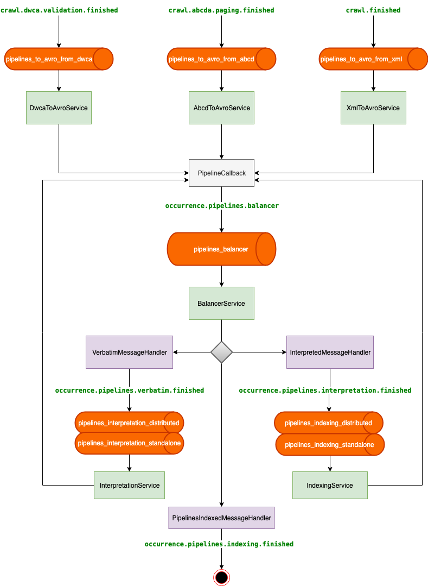

# GBIF Pipelines Ingestion Tasks Executor CLIs

## Overview

This module contains the CLI services that coordinate ingestion pipeline execution at GBIF. Each service listens to a RabbitMQ queue, processes messages, and publishes results to downstream queues or exchanges.

All services are bundled into a single fat jar: `pipelines-coordinator-cli.jar`.

## Architecture



The balancer sits between the crawler output and the pipeline workers. It inspects incoming messages and routes them to either a standalone (in-process) or distributed (Spark/Airflow) execution path based on dataset size.

## Available services

| Command | Description |
|---|---|
| `pipelines-balancer` | Routes datasets to standalone or distributed pipeline execution based on file/record size thresholds |
| `pipelines-dwca-to-verbatim` | Converts DwC-A archives to verbatim Avro |
| `pipelines-abcd-to-verbatim` | Converts ABCD archives to verbatim Avro |
| `pipelines-xml-to-verbatim` | Converts XML archives to verbatim Avro |
| `pipelines-validator-cleaner` | Cleans up validator artefacts |
| `pipelines-validator-metrics` | Computes validator metrics |
| `pipelines-archive-validator` | Validates DwC-A archives |

> Services other than the balancer are not yet documented in detail here.

## Running a service

```bash
java --add-opens java.base/java.lang=ALL-UNNAMED \
  --add-opens java.base/java.lang.invoke=ALL-UNNAMED \
  -jar target/pipelines-coordinator-cli.jar <command> \
  --log-config /path/to/logback-<command>.xml \
  --conf /path/to/<command>.yaml
```

## Service documentation

- [Pipelines Balancer](docs/pipelines-balancer.md)