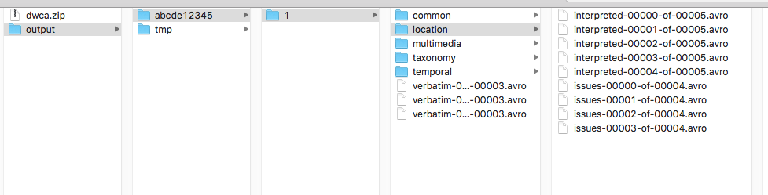

# Mini pipelines #
This project aims to provide a set of mini pipelines that can be used for testing or simply as tools for developers or small organizations. 

The jar generated to be used by others is `mini-pipelines.jar`.

## Dwca mini pipeline ##
This mini pipeline was created to work with Dwc-A as the input of the pipeline.

As defined in [this issue](https://github.com/gbif/pipelines/issues/116) this pipeline has the following limitations:
- It is intended to be used with small datasets (less than 1 million records).
- It works only in the local filesystem.
- All the interpretation based on external service will use the GBIF services only.
- The Elasticsearch schema will be aligned to the GBIF schema but it can change over time, users of this tool should expect continuos changes to the ES schema that could impact on the services depending on it.

### How to run the pipeline ###
The Main class that runs this pipeline is `DwcaPipeline` and it uses a `DwcaMiniPipelineOptions` for configuration.

The parameters that can be used can be seen using the `--help=DwcaMiniPipelineOptions` option:

~~~~
java -jar mini-pipelines.jar --help=DwcaMiniPipelineOptions
~~~~ 

This is an example to run this pipeline with the minimum required parameters:

~~~~
java -jar mini-pipelines.jar --inputPath=dwca.zip --targetPath=output --datasetId=abcde12345 --attempt=1 --gbifEnv=PROD --ESHosts=http://localhost:9200
~~~~ 

 This generates an output like this:

 

If we ignore the intermediate outputs using the next command there is no output written in the target path:

~~~~
java -jar mini-pipelines.jar --inputPath=dwca.zip --targetPath=output --datasetId=abcd1234 --attempt=1 --gbifEnv=PROD --ESHosts=http://localhost:9200 --ignoreIntermediateOutputs=true
~~~~ 

In this case, the output is the records indexed in ES. 
By default, the ES index name follows the format {datasetId}_{attempt} - in this example it's `abcde12345_1`. This index is added to the alias specified in the `ESAlias` parameter. By default it's `occurrence`.

Other examples of commands:
- Only DWCA_TO_AVRO step: 
~~~~
java -jar mini-pipelines.jar --inputPath=dwca.zip --targetPath=output --datasetId=https://api.gbif-dev.org/v1/geocode/reverse --attempt=1 --gbifEnv=PROD --ESHosts=http://localhost:9200 --pipelineStep=DWCA_TO_AVRO
~~~~ 

NOTE: at the time being the ES schema is temporary and the development of the pipeline is still in an early stage, therefore issues may be encountered.
